# 🛡️ HerShield – Women Safety App

### **A Real-Time Emergency Response & AI-Driven Safety Companion**

HerShield is a **Flutter + Firebase powered women safety mobile application** designed to provide **instant emergency assistance**, **AI-driven safety guidance**, and **stealth protection features** during dangerous situations.

Built as a **hackathon project**, HerShield focuses on **real-world emergency behavior**, **offline resilience**, and **fast, reliable response when every second matters**.

---

## 🚀 **Problem Statement**

Women often face unsafe situations where:

* Immediate help is difficult to access
* Panic makes decision-making hard
* Internet connectivity may be unavailable
* Using an obvious safety app could escalate the threat

### **HerShield solves this by combining:**

* One-tap SOS with live location sharing
* AI-powered safety assistant that listens and analyzes
* Multi-channel emergency alerts (SMS + WhatsApp)
* Stealth emergency mode (calculator disguise)

---

## ✨ **Key Features**

---

### 🧠 **AI Safety Assistant (Gemini-Powered)**

HerShield includes an intelligent **AI safety assistant** that supports users **before and during emergencies**.

* Chat-based interface where users describe their situation naturally
* AI **listens and analyzes messages in real time**
* Automatically detects **risk level** (Low / Medium / High)
* **Suggests activating SOS** when high-risk intent is detected
* Shows **India-specific emergency numbers**:

  * Police – **112**
  * Ambulance – **108**
* Users can **directly call emergency services from the chat screen**
* Context-aware modes:

  * **Unsafe** – Immediate danger
  * **Panic** – High anxiety situations
  * **Confused** – Need clarity
  * **General** – Safety guidance

> This ensures help is suggested **even before the user manually presses SOS**.

---

### 🚨 **Emergency SOS System**

* **One-tap SOS activation** from home screen
* **Shake-to-trigger SOS** for hands-free emergencies
* Automatic **live GPS location tracking**
* SOS lifecycle (start / update / stop) managed securely using Firebase
* Emergency alerts sent to trusted contacts via:

  * 📩 **SMS (works without internet)**
  * 💬 **WhatsApp (when internet is available)**

This guarantees alerts reach contacts even in poor network conditions.

---

### 📶 **Multi-Channel Alert Delivery (SMS + WhatsApp)**

HerShield avoids single-point failure by using **multiple communication channels**:

* **SMS fallback** when mobile data or Wi-Fi is unavailable
* **WhatsApp alerts** when internet is available for faster and richer communication
* Ensures maximum reach during emergencies

---

### 📍 **Live Location & Emergency Actions**

* **Continuous live location sharing** during SOS
* Location updates every few seconds
* Location shared **only while SOS is active**
* **Direct calling buttons**:

  * Call Police – **112**
  * Call Ambulance – **108**
* Open **Nearby Police Stations** and **Nearby Hospitals** in Maps

> Even without internet, maps may still open using **offline maps + GPS caching**.

---

### 🕶️ **Stealth / Hide Mode (Calculator Disguise)**

* Emergency screen can be **instantly hidden**
* Screen disguises itself as a **realistic calculator**
* SOS continues running silently in the background
* **Long-press `=`** to return to emergency screen

This protects users when visibly using a safety app could increase danger.

---

### 📳 **Shake-to-Trigger SOS**

* Shake phone to activate SOS discreetly
* Useful when user cannot unlock phone or navigate UI
* Works even under panic situations

---

## 🛠️ **Tech Stack**

| Layer          | Technology        |
| -------------- | ----------------- |
| Frontend       | Flutter (Dart)    |
| Backend        | Firebase          |
| Authentication | Firebase Auth     |
| Database       | Cloud Firestore   |
| Storage        | Firebase Storage  |
| Location       | Geolocator        |
| AI             | Google Gemini API |
| Maps           | Google Maps       |
| Alerts         | SMS + WhatsApp    |
| Utilities      | url_launcher      |

---

## 📱 App Screens

> Screenshots from the fully functional **HerShield** prototype.

---

### 🔐 Authentication
 | 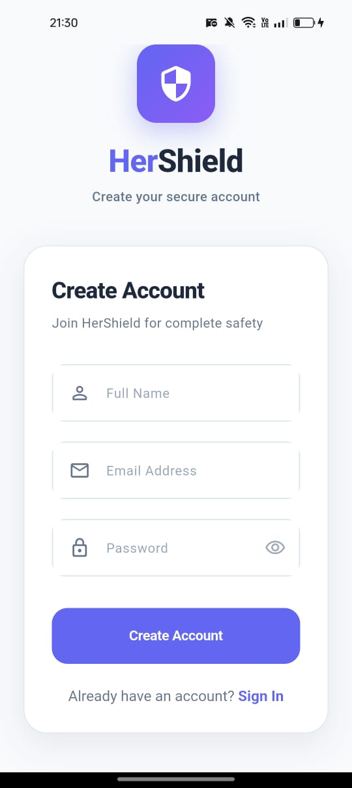

---

### 🧾 Profile Setup (Mandatory Safety Information)
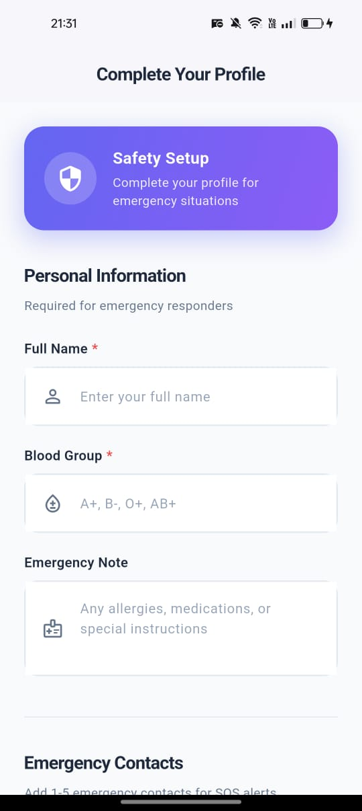 | 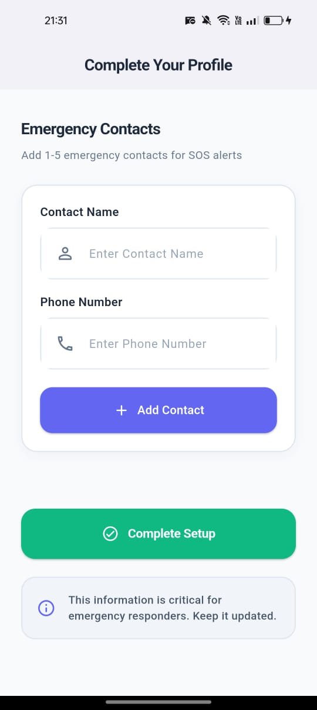 | 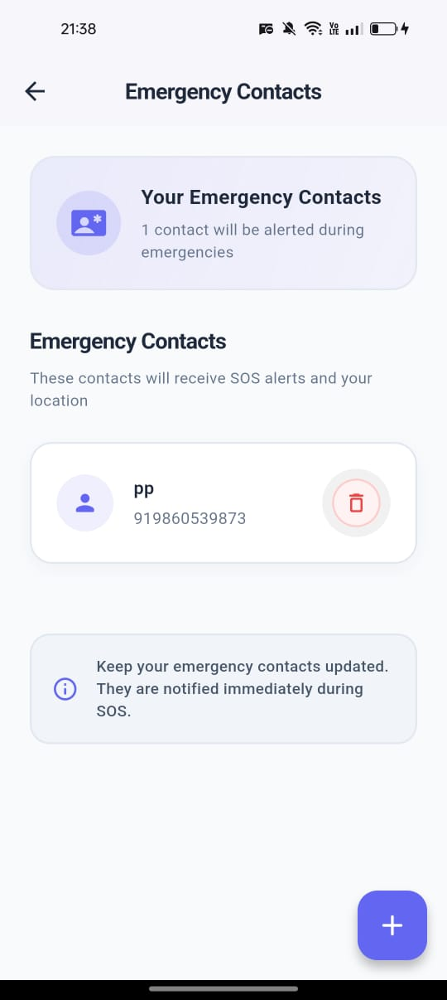

---

### 🏠 Home Screen & SOS Entry Point
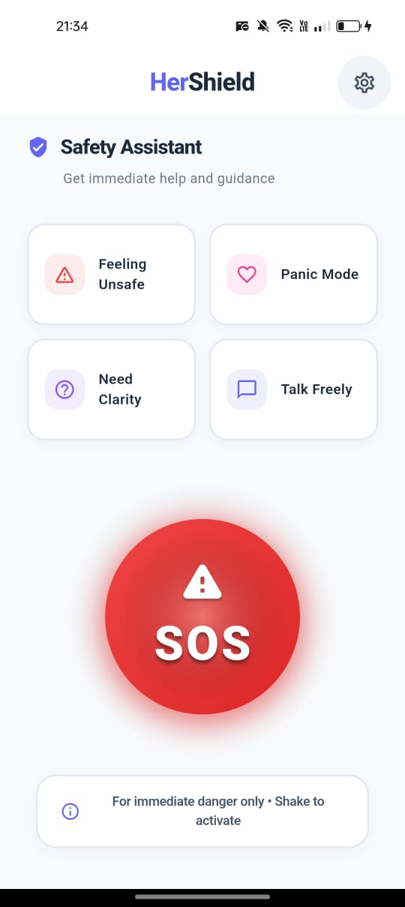

---

### 🧠 AI Safety Assistant
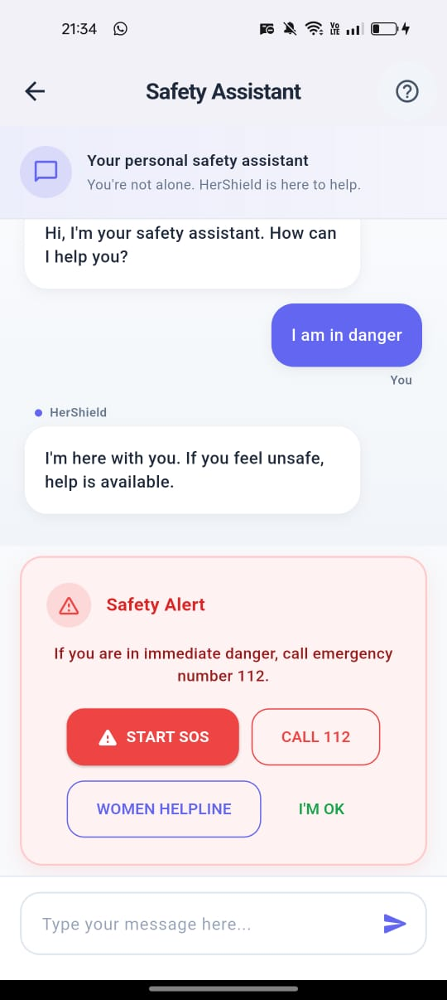

---

### 🚨 Emergency Mode (SOS Active)
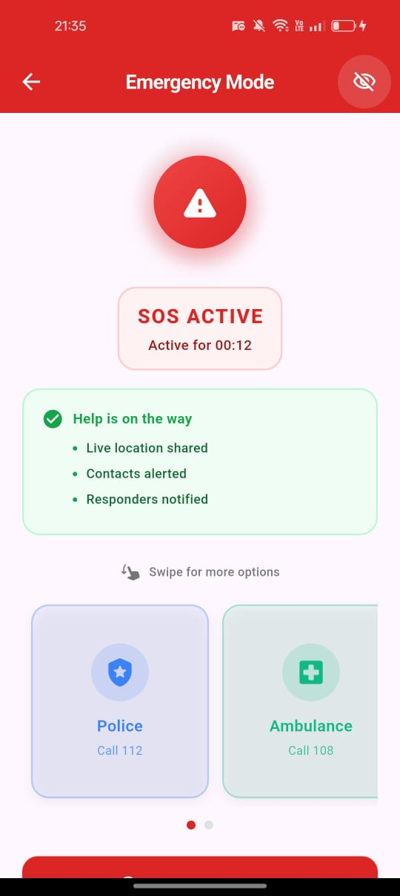 | 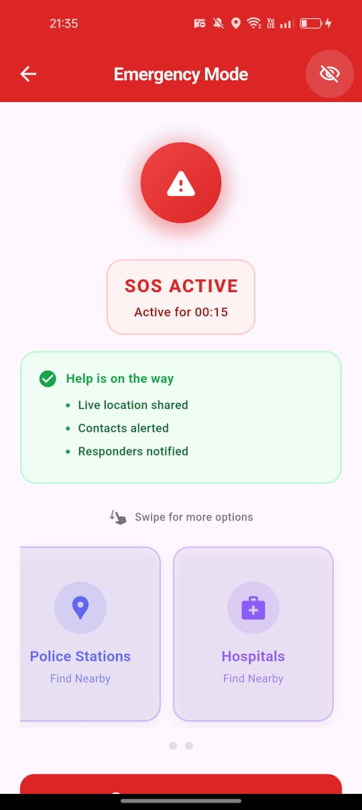

---

### 🕶️ Stealth Mode (Calculator Disguise)
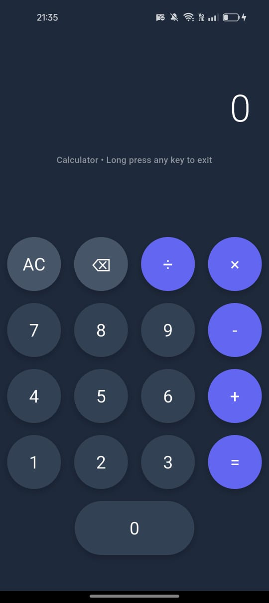

---

### 👤 Profile & Edit Flow
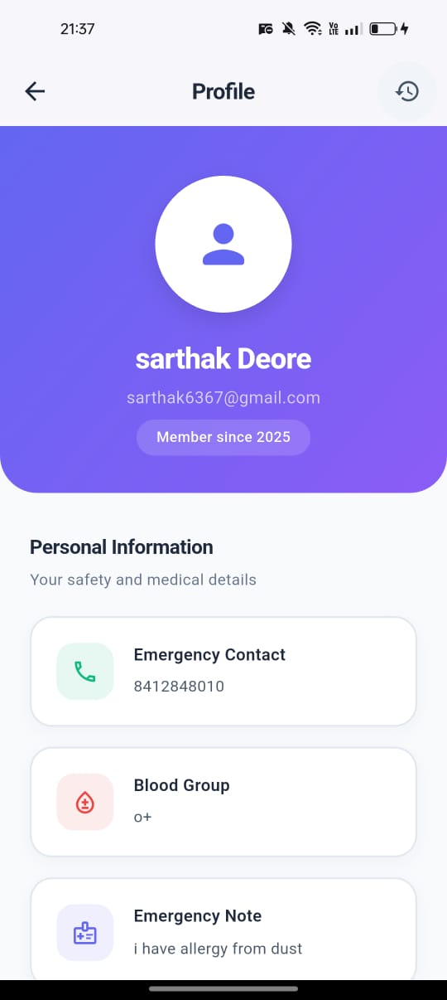 | 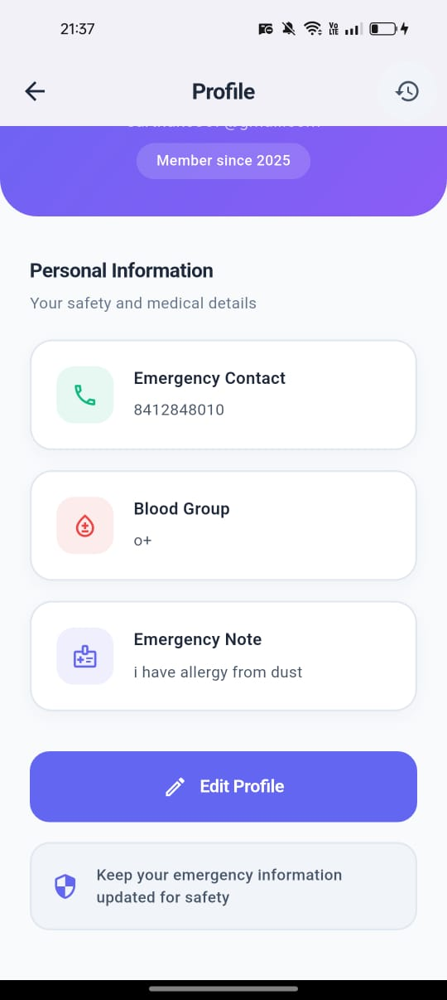 | 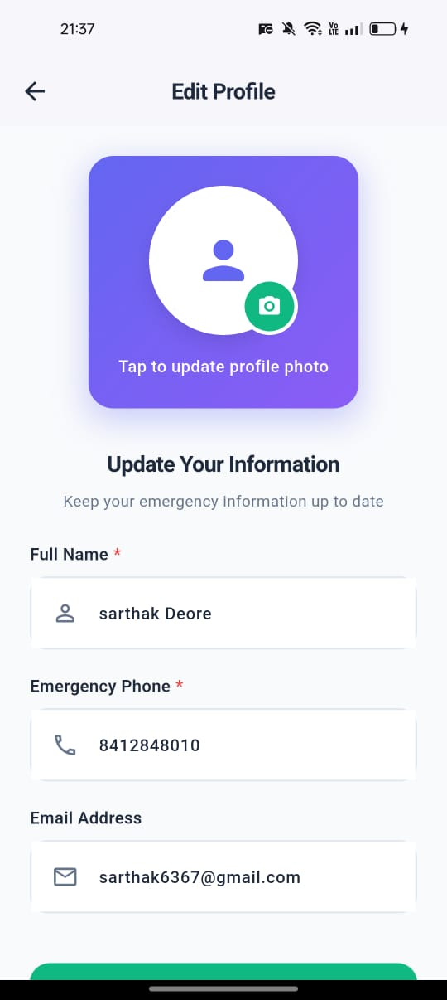 | 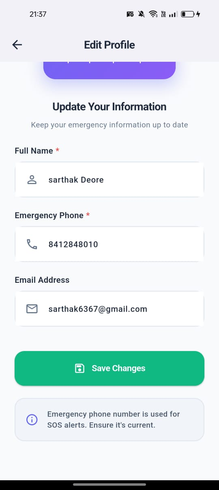 | 

---

### 📜 SOS History
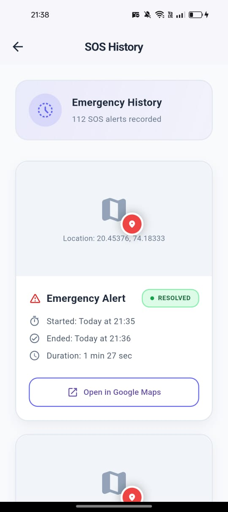

---

### ⚙️ Settings & Permissions
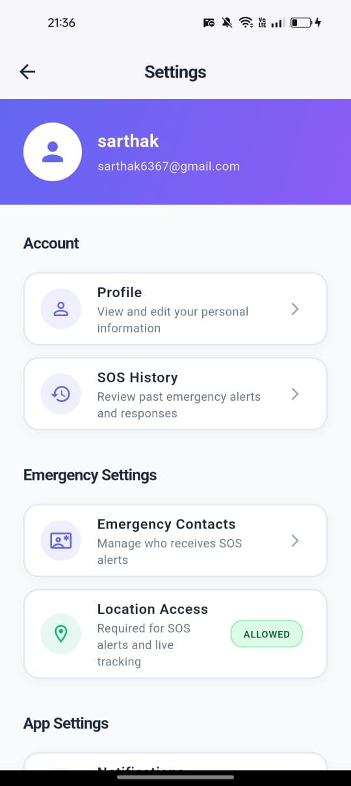 | 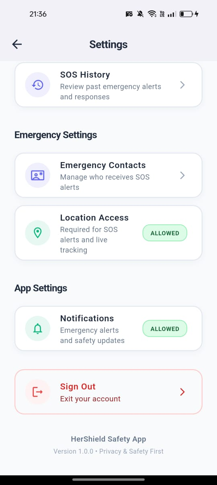

---

### 📇 Emergency Contacts Management
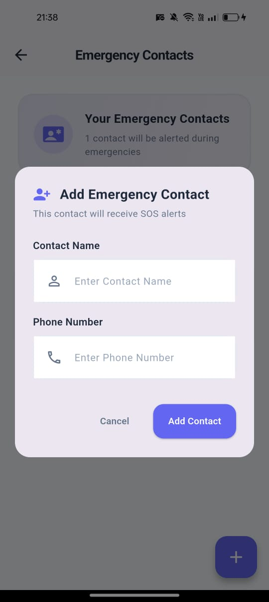

---

## 🔐 **Privacy & Safety Considerations**

* Minimal permissions – only what is required
* Location shared **only during active SOS**
* SOS runs silently in stealth mode
* No unnecessary data retention
* SMS ensures emergency alerts work without internet

> API keys are used only for hackathon/demo purposes.

---

## 🧪 **Demo Flow (For Judges)**

1. Launch app → Home Screen
2. Open **AI Safety Assistant**
3. Type: *“Someone is following me”*
4. AI analyzes message and **suggests SOS + emergency numbers**
5. User can **call police directly from chat**
6. Activate SOS
7. Emergency screen appears → live location sharing starts
8. Alerts sent via **WhatsApp + SMS fallback**
9. Hide screen → Calculator disguise
10. Long-press `=` → Return to emergency screen
11. Enable airplane mode → Demonstrate **offline SMS fallback**

---

## 🏆 **Why HerShield Stands Out**

✅ **AI that listens, understands, and suggests action**
✅ **Multi-channel alerts (SMS + WhatsApp)**
✅ **Offline-first emergency design**
✅ **Stealth protection for real-world threats**
✅ **UX designed for panic situations, not normal usage**

---

## 👥 **Team**

* **Sarthak Deore**
* **Apurva Deshpande**
* **Shreya Gaykar**
* **Esha Patil**

---

## 📌 **Future Roadmap**

* **Predictive Threat Analysis** using AI & crime data
* **Blockchain-secured incident logs** for legal evidence
* **Mesh network SOS** using Bluetooth / Wi-Fi Direct
* **Satellite SOS integration** for remote areas
* **IoT safety protocols** with smart homes & vehicles
* **Law enforcement dashboard** for real-time monitoring

---

## ✅ **Hackathon Ready**

* Fully functional prototype
* Real-world emergency features
* AI-driven decision support
* Offline + online reliability
* Clear problem → solution → demo flow

---

### **HerShield is not just an app — it is an intelligent safety companion that listens, analyzes, and acts when every second counts.**
